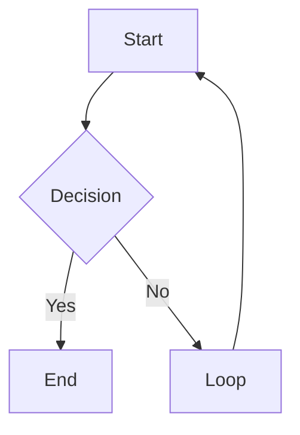

# Excalidraw PNG Export & Diagram Tools

This guide covers all available tools for creating, converting, and exporting Excalidraw diagrams.

## 🎯 Quick Links

### Main Export Tool (Recommended)
**Location**: [.agents/skills/excalidraw-diagram-generator/scripts/export-to-png.html](.agents/skills/excalidraw-diagram-generator/scripts/export-to-png.html)

This is your **all-in-one tool** for:
- ✅ Exporting `.excalidraw` files to PNG/SVG
- ✅ Converting Mermaid diagrams to Excalidraw
- ✅ One-click conversion + PNG export

**Open it now**:
```powershell
start .agents/skills/excalidraw-diagram-generator/scripts/export-to-png.html
```

### Alternative Mermaid Converter (Legacy)
**Location**: [tools/mermaid-to-excalidraw.html](tools/mermaid-to-excalidraw.html)

Focused only on Mermaid → Excalidraw conversion. Use the main tool above instead for full features.

## 📸 Exporting Diagrams to PNG

### Use Case 1: Add Diagrams to Documentation

You've created diagrams in Excalidraw and need PNG files for:
- PowerPoint presentations
- Markdown documentation  
- Word documents
- Website content

**Workflow**:
1. Open: `.agents/skills/excalidraw-diagram-generator/scripts/export-to-png.html`
2. Click "PNG Export" tab (default)
3. Drag and drop your `.excalidraw` file
4. Adjust settings:
   - Scale: **2x** (presentations) or **3x** (print)
   - Background: White or transparent
   - Padding: 20-40px
5. Click "Download PNG"

### Use Case 2: Create Diagram from Mermaid Syntax

You want to quickly create a flowchart or diagram using Mermaid:

**Workflow**:
1. Open: `.agents/skills/excalidraw-diagram-generator/scripts/export-to-png.html`
2. Click "Mermaid Converter" tab
3. Paste Mermaid code or load an example
4. Click "Convert & Export PNG"
5. Get both `.excalidraw` AND `.png` files!

## 🎨 Creating Diagrams

### Method 1: Using the Excalidraw Skill

Ask GitHub Copilot to create diagrams for you:

```
@copilot create a flowchart showing the sales process from lead to project delivery
```

The agent will:
1. Generate the `.excalidraw` file
2. Save it to your workspace
3. Provide export instructions

### Method 2: Using Mermaid Syntax

Write Mermaid code and convert it:



Then use the Mermaid Converter tool to get the `.excalidraw` file.

### Method 3: Manual Drawing

1. Go to [excalidraw.com](https://excalidraw.com)
2. Draw your diagram
3. Save as `.excalidraw` file
4. Use the PNG export tool when you need images

## 📚 Examples in This Workspace

Check out existing diagrams:

- [ai-promptengineering-visuals/00-what-is-prompt-engineering.excalidraw](ai-promptengineering-visuals/00-what-is-prompt-engineering.excalidraw) - Communication flow diagram
- [ai-promptengineering-visuals/01-prompt-building-blocks-pyramid.excalidraw](ai-promptengineering-visuals/01-prompt-building-blocks-pyramid.excalidraw) - Pyramid structure
- [ai-promptengineering-visuals/example-workflow.mmd](ai-promptengineering-visuals/example-workflow.mmd) - Mermaid flowchart
- [ai-promptengineering-visuals/prompt-blocks-flow.mmd](ai-promptengineering-visuals/prompt-blocks-flow.mmd) - Mermaid flow

**Try it yourself**:
1. Open the PNG export tool
2. Drag one of the `.excalidraw` files above
3. Export to PNG and see the results!

## 🔧 Advanced Features

### Using Icon Libraries

The Excalidraw skill supports professional icon libraries (AWS, GCP, etc.):

1. Download libraries from [libraries.excalidraw.com](https://libraries.excalidraw.com/)
2. Use the library splitter: `python .agents/skills/excalidraw-diagram-generator/scripts/split-excalidraw-library.py`
3. Add icons to diagrams: `python .agents/skills/excalidraw-diagram-generator/scripts/add-icon-to-diagram.py`

See [.agents/skills/excalidraw-diagram-generator/scripts/README.md](.agents/skills/excalidraw-diagram-generator/scripts/README.md) for details.

### Batch Processing

For multiple diagrams:
1. Keep the browser tool open
2. Process each file sequentially
3. All downloads go to your browser's download folder

### Custom Styling

Use DNV brand colors in your diagrams:
- Navy: `#0f204b`
- Dark Blue: `#003591`
- Light Blue: `#009fda`
- Green: `#3f9c35`

Apply these in Excalidraw or via Mermaid `style` commands.

## 💡 Tips & Best Practices

### For Presentations
- Use **2x scale** for crisp rendering
- White background works best
- Add 20-30px padding
- Export as PNG (not SVG) for compatibility

### For Print Documents
- Use **3x or 4x scale**
- White background
- 40px padding
- Consider SVG for vector quality

### For Web/Documentation
- Use **2x scale**
- Transparent or white background
- 20px padding
- PNG format for universal support

### For Technical Diagrams
- **SVG format** retains vector quality
- Can be edited in Inkscape or Illustrator
- Smaller file size than high-res PNG

## 🚀 Quick Start Checklist

Ready to create your first diagram?

- [ ] Decide on diagram type (flowchart, architecture, mind map, etc.)
- [ ] Choose creation method:
  - [ ] Ask Copilot to generate it
  - [ ] Write Mermaid syntax
  - [ ] Draw manually at excalidraw.com
- [ ] Open the export tool: `.agents/skills/excalidraw-diagram-generator/scripts/export-to-png.html`
- [ ] Export to PNG with desired settings
- [ ] Insert PNG into your documentation/presentation

## 📖 Additional Resources

- **Full Skill Documentation**: [.agents/skills/excalidraw-diagram-generator/SKILL.md](.agents/skills/excalidraw-diagram-generator/SKILL.md)
- **Scripts Documentation**: [.agents/skills/excalidraw-diagram-generator/scripts/README.md](.agents/skills/excalidraw-diagram-generator/scripts/README.md)
- **Excalidraw Website**: https://excalidraw.com
- **Mermaid Documentation**: https://mermaid.js.org/
- **Icon Libraries**: https://libraries.excalidraw.com/

---

**Questions?** Ask GitHub Copilot:
```
@copilot how do I export my Excalidraw diagram to PNG?
@copilot create a flowchart showing [your process]
@copilot convert this Mermaid code to Excalidraw
```
