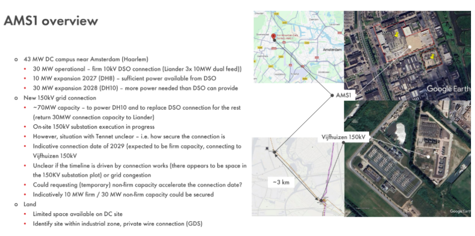

# Professional Services Proposal

## Data Centre Grid Capacity Upgrade Analysis

### Technical Advisory for 30MW to 70MW Connection Enhancement

Prepared for:
Martijn Bout
Iron Mountain (Nederland) Data Centre B.V.
Lucasweg 35, 2031 BE Haarlem
The Netherlands

Prepared by:
DNV Netherlands B.V.
Utrechtseweg 310-B50
6812 AR Arnhem
The Netherlands
KvK: 9006404
VAT: NL002465848B68

Contact person:
Sonja Berlijn
Email: sonja.berlijn@dnv.com
Phone: +31 (0)26 356 2370

Date: December 11, 2025
Proposal valid until: December 22, 2025
Proposal ID: DNV-2025-IronMountain
Version: 2

---

## Executive summary

Iron Mountain is seeking to upgrade its data center connection capacity from the current **30 MVA connection with Liander** (medium voltage) to a **70 MVA connection with TenneT** (high voltage) at the same location in Haarlem. Due to regional grid congestion, standard capacity requests face significant delays and potential rejection.

DNV proposes a **technical-first approach** to position Iron Mountain as an interactive grid partner rather than a passive consumer. By identifying concrete technical solutions to mitigate grid congestion—such as Battery Energy Storage Systems (BESS), demand flexibility, and grid support technologies—we will prepare Iron Mountain for substantive discussions with TenneT that focus on mutual benefit rather than one-sided capacity requests.

This proposal outlines a three-phase, gated approach. First, we clarify Iron Mountain's objectives and connection requirements. Second, together with Iron Mountain, we explore with TenneT how their current process deals with this type of request and whether there is room for a more tailored, "interactive consumer" approach. Only if there appears to be such room do we proceed to a third phase in which we further develop technical options to support the case. The work is offered on a time-and‑materials basis so that the level of effort in later phases can be adjusted to what is practically possible.

---

## 1. Project background and objectives

### 1.1 Current situation

Iron Mountain operates the AMS1 data center campus near Amsterdam (Haarlem), approximately 3 km from the Vijfhuizen 150kV substation. The site currently has:

- 30 MW operational capacity via Liander (10kV DSO connection, configured as 3x 10MW dual feed);
- 10 MW expansion approved for 2027, using available power from the existing DSO connection; and
- planned 30 MW expansion in 2028 (DH10 facility), which requires more power than the DSO can provide.

To support the 2028 expansion and future growth, Iron Mountain is pursuing a new 150kV grid connection to TenneT at the Vijfhuizen substation. The target is approximately 70 MW total capacity, which would power the DH10 expansion and eventually replace the DSO connection for the rest of the campus (returning 30 MW connection capacity to Liander). An on‑site 150kV substation is already under construction.

The situation with TenneT regarding how to secure this connection remains unclear. The indicative connection date is 2029 (expected to be firm capacity, connecting to Vijfhuizen 150kV), but the timeline appears to be driven either by availability of space in the 150kV substation plot or by regional grid congestion. Without a clear technical engagement strategy, Iron Mountain risks extended delays in a context where standard capacity requests in Noord‑Holland face significant waiting lists.

### 1.2 Strategic objectives

This project has both an immediate and a strategic objective. In the short term, the aim is to enable an increase in connection capacity from 30 MVA to 70 MVA in a way that is compatible with local grid constraints. In parallel, Iron Mountain wishes to build a better understanding of how the regional grid operates and to explore how the site can act as an interactive participant in the energy system rather than a purely passive consumer.

### 1.3 DNV's approach

Unlike traditional lobbying or simple capacity requests, the focus of this project is a technical solution framework. We will analyse local grid constraints at the relevant connection points, identify technical options to mitigate congestion (for example, storage, demand flexibility and other grid support services), and prepare a set of concrete alternatives that can be discussed with TenneT. The intent is to position Iron Mountain as a party that can contribute to resolving local constraints while meeting its own capacity needs.

---

## 2. Scope and phased approach

### Phase 1 – Iron Mountain case and objectives

Objective: obtain a clear and shared understanding of Iron Mountain's current position, connection requirements and underlying objectives.

In this phase we review the current situation at the AMS1 campus, including the existing 30 MW Liander connection (3x 10MW dual feed configuration), the approved 10 MW expansion for 2027, and the planned 30 MW DH10 expansion driving the need for the new TenneT connection. We document the target of approximately 70 MW total capacity via the new 150kV connection at Vijfhuizen substation, the status of the on‑site 150kV substation construction, and the indicative 2029 connection date.

We also clarify Iron Mountain's underlying objectives: timing requirements (is 2029 acceptable or does earlier access matter?), appetite for phased approaches (for example, 10 MW firm + 30 MW non‑firm capacity as an interim step), willingness to consider operational flexibility (load curtailment, demand response), and constraints imposed by limited space on the DC site. The review includes load and consumption data, connection documentation, correspondence with Liander and TenneT, and an assessment of the private wire (GDS) option given the site's location in an industrial zone.

Key questions to be clarified:
- Is the 2029 timeline driven by TenneT grid capacity constraints or by substation plot availability?
- Would a phased capacity request (partial firm + non‑firm) accelerate the connection date?
- What are the site‑specific space constraints for flexibility measures (BESS, on‑site generation)?
- What is the status and viability of the private wire / GDS route?

The outcome of Phase 1 is a concise case description covering what is being requested, why it is needed, what flexibility is and is not acceptable, and which constraints are non‑negotiable from Iron Mountain's perspective.

### Phase 2 – TenneT process and engagement

Objective: jointly explore with TenneT how this type of request is handled in their current process and whether there is meaningful room for tailored solutions.

In this phase Iron Mountain invites DNV to participate as technical advisor in one or more exploratory discussions with TenneT. Together we aim to clarify how queueing and capacity allocation are organised for the Vijfhuizen 150kV connection point, which steps are fixed and where, if anywhere, there is scope to take into account an "interactive consumer" approach or supporting measures on the customer side.

Specific questions for the TenneT engagement:
- How is the 2029 indicative connection date determined – is it driven by grid capacity constraints at Vijfhuizen or by substation plot availability?
- What is TenneT's current view on grid congestion in the Vijfhuizen / Haarlem area, and are there specific constraints that flexibility from Iron Mountain could help address?
- Is there room for a phased capacity approach (for example, 10 MW firm capacity + 30 MW non‑firm capacity as an interim step to accelerate the connection date)?
- What is TenneT's position on the private wire / GDS route, given that the AMS1 site is within an industrial zone?
- Under what conditions, if any, could additional flexibility or grid support from Iron Mountain influence the capacity allocation process or timeline?

Based on these discussions we document the process as it applies to Iron Mountain, including the practical implications for timelines and decision points. We also provide a brief assessment of whether there appears to be sufficient room to justify further work on detailed technical options at this stage.

### Phase 3 – Technical options and roadmap (conditional)

Objective: if Phase 2 indicates that there is meaningful room for tailored solutions, develop a limited number of technical options and a corresponding roadmap that can support Iron Mountain’s case.

If the outcome of Phase 2 is positive, we proceed to outline two to three technical concepts that could help address local constraints or provide additional flexibility. Given the limited space available on the AMS1 DC site, we will prioritize compact and operationally compatible solutions:

- **Compact battery energy storage (BESS)**: Sizing and configuration of battery systems that fit within the available site footprint, providing peak shaving, frequency regulation, or backup power while reducing grid burden during critical periods.
- **Demand response and load curtailment**: Identification of non‑critical data center loads that can be temporarily curtailed or shifted during grid stress events, potentially enabling a higher non‑firm capacity allocation.
- **Phased capacity strategy**: Detailed modelling of a staged approach (for example, start with 10 MW firm + 30 MW non‑firm, transition to full 70 MW firm as grid capacity becomes available), including operational and commercial implications.
- **Private wire optimization**: If the GDS route is viable given the industrial zone location, technical and regulatory considerations for optimizing the private connection design.

For each concept we describe the main technical characteristics, the indicative order of magnitude of investment and operating impacts, and the way it could be brought into the dialogue with TenneT.

The results of Phase 3 are summarised in a short options note and an updated roadmap. If Phase 2 shows that the current TenneT process offers little or no room for such solutions at this time, Phase 3 can either be scaled back to a brief documentation of possible future directions or not carried out.

---

## 3. Deliverables overview

The main deliverables foreseen in this assignment are:

- Phase 1 note describing Iron Mountain’s current connection, requested upgrade and objectives, including an initial view on acceptable and non‑acceptable flexibility;
- Phase 2 process description summarising how TenneT handles this type of request in practice for the relevant connection point, what this implies for Iron Mountain, and an assessment of the apparent room for tailored solutions; and
- if justified, a short Phase 3 options note and roadmap outlining two to three technical concepts and how they could be used in future discussions with TenneT.

All deliverables will be provided in English to accommodate Iron Mountain's international operating environment.

---

## 4. Project timeline

The work is intended to start with a kick‑off meeting on 5 January 2026 at 15:00. The indicative timing below assumes that data and stakeholders are available as planned; actual dates can be adjusted in consultation with Iron Mountain and TenneT.

- Weeks 1–2: Phase 1 – review of Iron Mountain’s situation and objectives; preparation and agreement of the Phase 1 note.
- Weeks 2–4: Phase 2 – preparation and execution of one or more exploratory meetings with TenneT; preparation of the process description and assessment of room for tailored solutions.
- Weeks 4–6 (conditional): Phase 3 – development of technical options and roadmap, if Phase 2 indicates that this is justified and useful at this stage.

Short progress calls can be scheduled as needed, with at least one interim discussion at the end of Phase 1 and at the end of Phase 2.

---

## 5. Iron Mountain resource requirements

To ensure efficient execution within the NTE budget, DNV will require access to the following Iron Mountain resources during the project:

### Phase 1 (weeks 1–2)

- Project sponsor or senior management: 2–3 hours total (kick‑off meeting, final Phase 1 review).
- Operations / facility management: 3–4 hours total (current load profile explanation, operational flexibility discussion).
- Engineering / technical lead: 3–4 hours total (connection documentation review, technical constraints discussion).
- Commercial / legal (optional): 1 hour (review of past TenneT/Liander correspondence, if needed).

### Phase 2 (weeks 2–4)

- Project sponsor or senior management: 3–4 hours total (TenneT meeting attendance, Phase 2 decision gate discussion).
- Engineering / technical lead: 4–5 hours total (TenneT meeting preparation and attendance, technical clarifications).
- Legal / contracts (optional): 1–2 hours (review of TenneT process implications, if needed).

### Phase 3 (weeks 4–6, if applicable)

- Engineering / technical lead: 3–4 hours total (review of technical options, roadmap validation).
- Operations / facility management: 2–3 hours total (operational impact assessment of proposed options).

In addition to these scheduled interactions, DNV may require ad‑hoc email or brief phone clarifications (estimated at 1–2 hours per week across all roles). Timely availability of key personnel and data will be critical to staying within the indicative timeline and NTE budget.

---

## 6. Project team

DNV has assembled a specialized team with deep expertise in grid integration, data center energy systems, and TenneT engagement.

### 5.1 Core team

**Sonja Berlijn – Project Manager & Lead Consultant**

- Role: Primary point of contact, overall project delivery
- Expertise: Grid connection strategies, TSO engagement, energy transition
- Experience: 12+ years in Dutch electricity sector, extensive TenneT collaboration
- Responsibilities: Project coordination, client liaison, TenneT engagement strategy

**xx – Senior Grid Integration Engineer**

- Role: Technical lead for grid analysis and solution design
- Expertise: High-voltage grid modeling, BESS integration, power system stability
- Experience: 15+ years in transmission network planning and grid code compliance
- Responsibilities: Grid constraint analysis, technical solution development, TenneT documentation

**Technical Specialist – Energy Storage & Flexibility**

- Role: BESS and demand response solution design
- Expertise: Battery energy storage systems, frequency regulation, capacity markets
- Experience: 8+ years in energy storage projects and grid services
- Responsibilities: BESS sizing and configuration, financial modeling, grid services assessment

### 5.2 Quality assurance

All technical deliverables will be reviewed by DNV's internal quality assurance process to ensure accuracy, compliance, and professional standards.

---

## 7. Commercial terms

### 6.1 Basis and not-to-exceed cap

The work described in this proposal will be carried out on a time‑and‑materials basis with a not‑to‑exceed (NTE) cap of €35,000 (excl. VAT). Iron Mountain will be invoiced for the actual hours worked and agreed expenses, using DNV's standard hourly rates for the staff involved, up to the NTE limit.

For planning purposes, we estimate the following order of magnitude of effort:

- Phase 1: approximately 3–5 consultant days for review, discussions and documentation;
- Phase 2: approximately 4–6 consultant days for preparation, participation in meetings with TenneT and documentation of the process; and
- Phase 3 (if carried out): approximately 4–6 consultant days for developing technical options and preparing the roadmap.

These figures are indicative and assume efficient collaboration. The total effort across all three phases is estimated at 11–17 consultant days. Based on a blended rate of approximately €190–200 per day (assuming a mix of Grade 5-7 and Grade 8-9 resources), the total cost is estimated at €21,000–34,000, which fits within the €35,000 NTE cap.

### 6.2 Hourly rates and invoicing

The following rates apply for this assignment (all amounts excl. VAT):

- Sonja Berlijn (project manager / senior consultant, Grade 5-7): €179 per hour;
- Senior grid integration engineer (Grade 8-9): €222 per hour;
- Technical specialist (Grade 5-7, if required): €179 per hour.

Travel time for agreed meetings (for example, site visits and meetings with TenneT) will be charged at 50% of the applicable hourly rate. Reasonable travel expenses (train, local transport) will be invoiced at cost with supporting receipts. All fees and expenses are subject to the €35,000 NTE cap.

Invoices will be issued monthly in arrears, based on a summary of hours worked and expenses incurred. Each invoice will include a cumulative total showing remaining budget under the NTE cap.

### 6.3 Exit clause and Phase 2 decision gate

As outlined in the scope, Phase 3 is explicitly conditional on the outcome of Phase 2. If the Phase 2 assessment concludes that there is insufficient room within TenneT's current process to pursue tailored solutions, Iron Mountain may elect to close the assignment at that point.

In that scenario, Iron Mountain will only be invoiced for the hours and expenses incurred during Phases 1 and 2. No further work will be carried out and no additional fees will be charged beyond what has been documented up to the Phase 2 conclusion. This serves as a formal financial exit clause.

### 6.4 Payment terms

Payment is due within 30 days of the invoice date. Invoices will include VAT at the applicable Dutch rate (currently 21%). Payment is to be made by bank transfer to DNV Netherlands B.V. (details will be provided on the invoice).

---

## 8. Terms and conditions

### 7.1 Contract basis

This proposal, upon acceptance by Iron Mountain, shall constitute a binding agreement between Iron Mountain (Nederland) Data Centre B.V. and DNV Netherlands B.V. The engagement will be governed by DNV's standard consulting terms and conditions, which emphasize:

- Professional standards of care and industry best practices
- Confidentiality of client information and project details
- Intellectual property rights (client owns deliverables, DNV retains methodologies)
- Liability limitations consistent with professional services industry standards

### 7.2 Confidentiality

DNV acknowledges that all information provided by Iron Mountain, including operational data, expansion plans, and financial information, is confidential and proprietary. DNV will:

- Not disclose client information to third parties without written consent (except as required by law)
- Use information solely for the purposes of this engagement
- Return or destroy confidential information upon project completion (if requested)

### 7.3 Project success factors

Successful project delivery depends on:

1. **Timely Data Provision:** Iron Mountain to provide all requested data and documentation within 5 working days of request
2. **Stakeholder Availability:** Key Iron Mountain personnel available for workshops and review meetings
3. **TenneT Cooperation:** TenneT's willingness to engage in discussions (DNV will facilitate but cannot guarantee TenneT response times)
4. **Scope Stability:** Material changes to project scope will be managed via change control procedure with associated cost/timeline adjustments

### 7.4 Assumptions

This proposal assumes:

- Iron Mountain has legal right to request the connection upgrade
- Basic site electrical data and load profiles are available
- No detailed physical site surveys or electrical testing are required
- TenneT will respond to connection request within reasonable timeframe (note: TenneT response times are outside DNV's control)
- No major regulatory changes during the 6-week project period

### 7.5 Risk and limitations

**Important Notice:** DNV's role is advisory only. We cannot guarantee TenneT approval of the connection upgrade, as this decision rests solely with TenneT based on grid conditions, regulatory requirements, and commercial considerations. Our value proposition is to maximize the probability of approval by presenting Iron Mountain as a technically sophisticated grid partner with concrete solutions to mutual challenges.

---

## 9. Role of DNV in this project

### 8.1 Relevant experience

DNV works on grid integration and capacity issues for network operators, large consumers and data centres in the Netherlands and other European countries. The project team proposed for this assignment has experience with:

- connection studies at transmission and distribution level;
- projects involving TenneT and regional DSOs; and
- technical option assessments for flexibility and storage solutions.

This experience is intended to support Iron Mountain in preparing a well‑founded technical case for the requested capacity increase.

### 8.2 Working approach

Our intention is to work in a transparent and pragmatic way. The emphasis will be on clear technical analysis rather than lobbying or advocacy. For each option we will make underlying assumptions and limitations explicit and we will adapt the level of detail to the decisions Iron Mountain needs to take. Throughout the project we will check interim results with Iron Mountain to confirm that the work remains aligned with your objectives and constraints.

### 8.3 Limitations

---

## 10. Next steps

To proceed with this engagement we suggest the following sequence. First, review the proposal internally and share any comments or adjustments. If the scope and planning are acceptable, confirm acceptance by returning a signed copy or issuing a purchase order so that the project can be scheduled around the proposed kick‑off on 5 January 2026 at 15:00. In parallel, the key data items (load profiles, connection documentation and expansion plans) can be prepared so that Phase 1 can start without delay.

### 9.1 Questions and contact

For questions or clarifications regarding this proposal, please contact:

Sonja Berlijn
Project manager
DNV Netherlands B.V.
Email: sonja.berlijn@dnv.com
Phone: +31 (0)26 356 2370

We are excited to partner with Iron Mountain on this critical capacity upgrade and look forward to demonstrating how technical innovation can unlock grid capacity in congested regions.

---

## 11. Proposal acceptance

By signing below, Iron Mountain (Nederland) Data Centre B.V. accepts this proposal and authorizes DNV Netherlands B.V. to commence work as outlined.

**For Iron Mountain (Nederland) Data Centre B.V.:**

Signature: _______________________________
Name: Martijn Bout
Title: Director
Date: _______________________________

**For DNV Netherlands B.V.:**

Signature: _______________________________
Name: Sonja Berlijn
Title: Senior Consultant & Project Manager
Date: _______________________________

---

**Proposal ID:** DNV-2025-IronMountain
**Version:** 2.0
**Date:** December 11, 2025
**Valid Until:** December 22, 2025

---

*This proposal is confidential and proprietary to DNV Netherlands B.V. No part of this proposal may be reproduced, distributed, or disclosed to third parties without written permission from DNV.*
