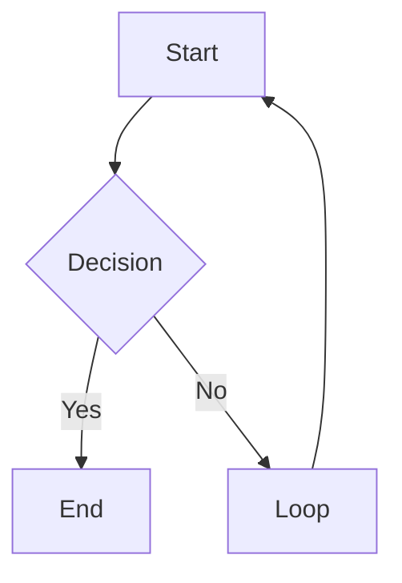
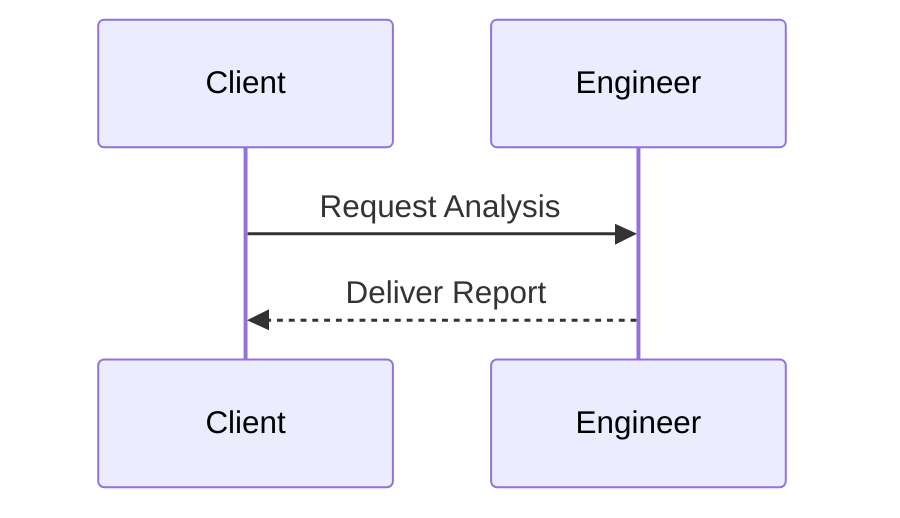
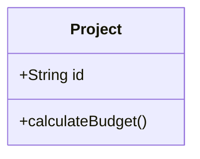
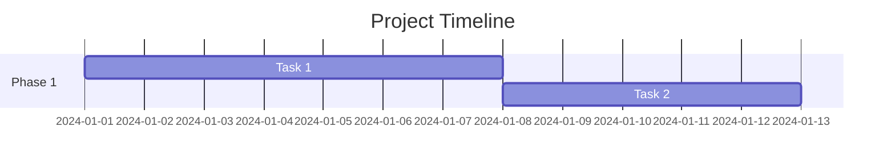
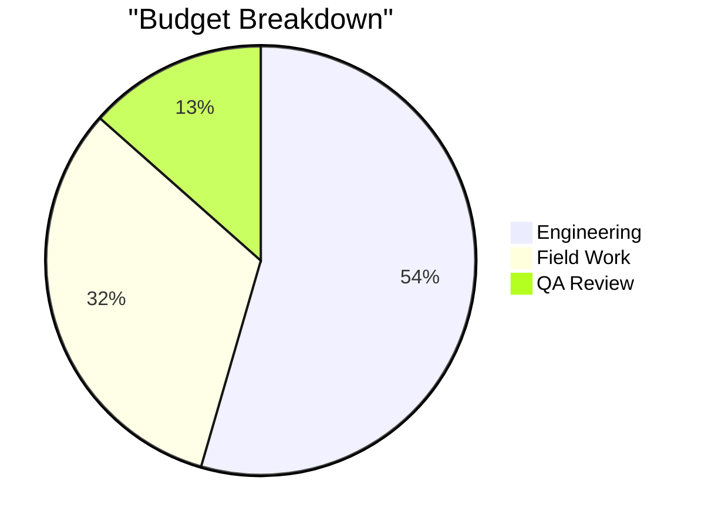
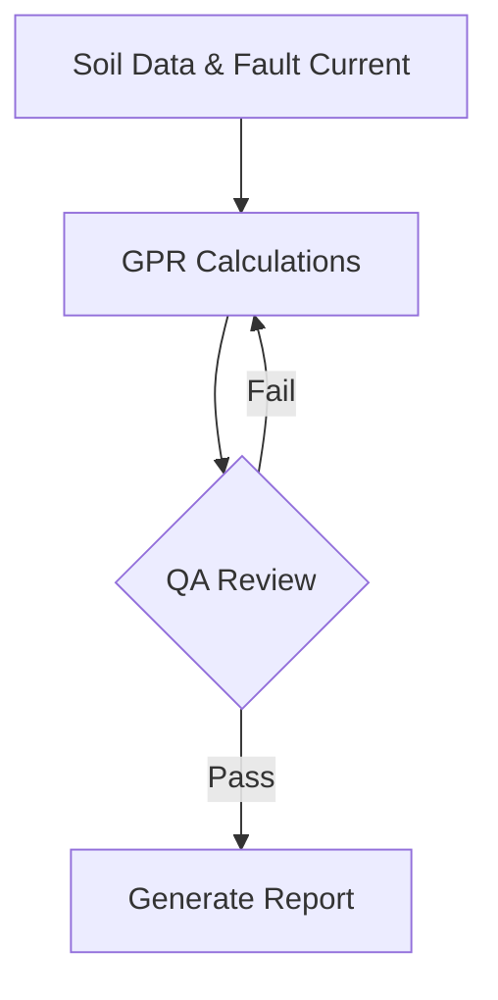
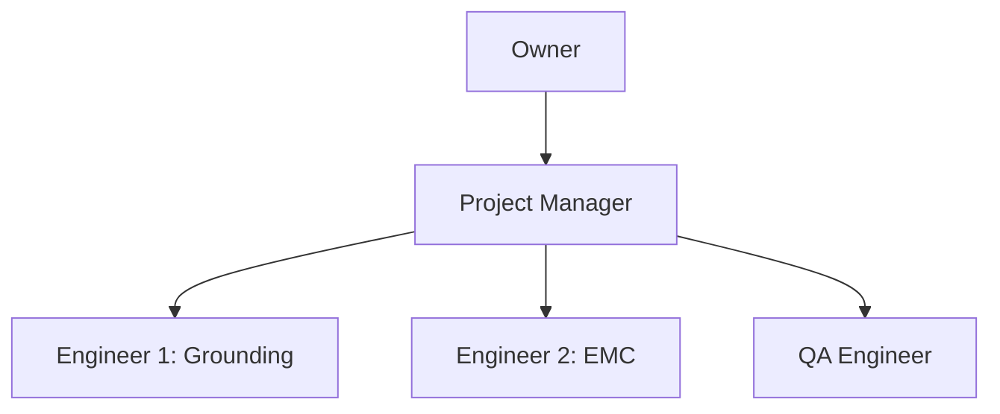
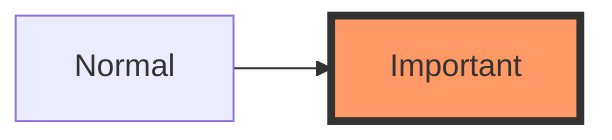

# Mermaid to Excalidraw Converter

Convert Mermaid diagrams to Excalidraw format for visual editing.

## 🎯 Quick Start

### Browser-Based Converter (Recommended)

1. **Open the HTML file**:
   ```powershell
   # From VS Code
   # Right-click on tools/mermaid-to-excalidraw.html → "Open with Live Server"
   # Or simply open the file in your browser
   start tools/mermaid-to-excalidraw.html
   ```

2. **Use the interface**:
   - Paste your Mermaid diagram text in the left panel
   - Click "✨ Convert" to generate Excalidraw JSON
   - Click "💾 Download .excalidraw" to save the file
   - Open the `.excalidraw` file in Excalidraw

### Features

✅ **Live Conversion** - Instant preview of converted diagrams  
✅ **Multiple Diagram Types** - Flowcharts, sequence, class, gantt, pie  
✅ **Download Support** - Save as `.excalidraw` files  
✅ **Copy to Clipboard** - Easy JSON export  
✅ **Example Library** - Pre-loaded examples to get started  

## 📊 Supported Diagram Types

### Flowcharts


### Sequence Diagrams


### Class Diagrams


### Gantt Charts


### Pie Charts


## 🔧 Use Cases in Your Workflow

### 1. **Project Workflows**
Convert your sales → delivery → closeout process into visual diagrams:


### 2. **Technical Process Flows**
Visualize IEEE 80 calculation workflows:


### 3. **Org Charts & Team Structure**
Map engineer skills and project assignments:


## 📝 Workflow Integration

### Option 1: Direct Browser Use
1. Keep `tools/mermaid-to-excalidraw.html` bookmarked
2. Paste Mermaid text → Convert → Download
3. Import into Excalidraw for editing

### Option 2: VS Code Integration
1. Install "Live Preview" extension
2. Right-click HTML file → "Show Preview"
3. Convert diagrams without leaving VS Code

### Option 3: Save as .mmd Files
1. Save Mermaid diagrams as `.mmd` files in your project
2. Use the browser tool to convert when needed
3. Version control both `.mmd` (source) and `.excalidraw` (visual)

## 🎨 Styling Tips

Mermaid supports basic styling that transfers to Excalidraw:



Use DNV brand colors in your diagrams:


## 🚀 Advanced Usage

### Batch Conversion (Future Enhancement)
The Node.js script `scripts/mermaid-to-excalidraw.js` was intended for batch processing but requires additional setup. For now, use the browser tool for individual conversions.

### Integration with Excalidraw Skill
You can also use the Excalidraw diagram generator skill:
```
@copilot create a flowchart showing project lifecycle from lead to closeout
```

This will generate diagrams directly using natural language.

## 📚 Resources

- **Mermaid Syntax**: https://mermaid.js.org/
- **Excalidraw**: https://excalidraw.com/
- **DNV Brand Colors**: `config/dnv-brand-colors.json`

## 🐛 Troubleshooting

**Q: Diagram doesn't convert**  
A: Check Mermaid syntax at https://mermaid.live/ first

**Q: Styling doesn't transfer**  
A: Some advanced Mermaid styles may not convert; edit in Excalidraw after conversion

**Q: Can I edit the Excalidraw file?**  
A: Yes! Open the `.excalidraw` file at https://excalidraw.com/ and edit freely

---

**Pro Tip**: Keep your Mermaid source in `.mmd` files for version control, then export to Excalidraw for client-facing presentations!
